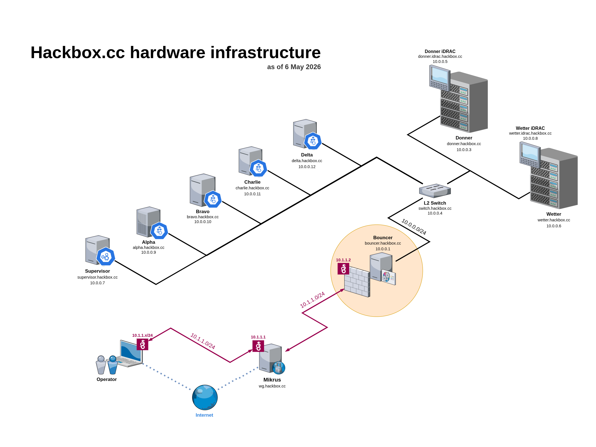

# Physical architecture

This document describes the topology and components of Hackbox.cc network.

## Diagram

*Hackbox.cc hardware infrastructure (as of 6 May 2026).*

## Segment layout

| Segment | Range | Role |
|---------|-------|------|
| WireGuard network (QA) | `10.1.1.0/24` | VPN tunnel from the **Mikrus** host; staff access to the infrastructure over encrypted traffic (red lines / tunnel in the diagram). |
| Internal LAN | `10.0.0.0/24` | Production hosts and management (**Bouncer** as gateway, servers, iDRAC). |
| PREPROD (planned) | `10.3.3.0/24` | Separate WireGuard interface on Mikrus — in preparation. |

Path from the outside (simplified): **Internet → Mikrus (`wg.hackbox.cc`) → WG tunnel → Bouncer (`10.1.1.2` on WG) → LAN (`10.0.0.1`) → hosts in `10.0.0.0/24`.**

---

## Mikrus (`wg.hackbox.cc`)

Debian VPS (**384 MB RAM**, CPU cores: **0.5** from 6 (1 thread from 12 available) on Intel i7-8700, **5 GB** disk).

- **WireGuard:** port `20122`, QA network `10.1.1.0/24`; hosts on this network can reach the physical QA LAN that includes Hackbox.cc hosts in `10.0.0.0/24`.
- **DNS:** subdomain `wg.hackbox.cc`;
- **SSH:** port `10122` — for now, only local system users (LDAP accounts are not wired up yet).
- **Forwarded ports:** `30122` (TCP/UDP) — planned additional WireGuard for PREPROD (`10.3.3.0/24`); `40505` — TCP only for other services.
- **Monitoring:** Prometheus Node Exporter on port `9100` for host metrics and `8787` for WireGuard-specific metrics, listening on all interfaces; reachable only from the WG network because that port number is not available on the WAN interface.

---

## Bouncer (`bouncer.hackbox.cc`)

**Hardware:** Dell Optiplex 5050 SFF, i3-7100 (**2 cores**), 120 GB SATA SSD, **Intel Pro/1000 PT** NIC (4× GbE), 4 GB RAM (type: DDR4).

- **Addresses:** `10.0.0.1` (LAN), `10.1.1.2` (WireGuard network); FQDN `bouncer.hackbox.cc`
- **System:** OPNsense 26.1.6 (FreeBSD)
- **Functions:** DHCP, DNS (Unbound) for the WireGuard and LAN networks (domain `hackbox.cc`), WireGuard ↔ LAN relay, firewall, router.
- **Plugins:** `os-node-exporter` (built-in host metrics export for Prometheus), `os-acme-client` (TLS certificate issuance and renewal via ACME, e.g. Let's Encrypt)

---

## Supervisor (`supervisor.hackbox.cc`)

**Hardware:** Dell Optiplex 3050 SFF, i5-6600 (**4 cores**), 16 GB RAM (RAM type: DDR4), 1 TB NVMe SSD + 2 TB SATAIII HDD, Debian 13, Realtek RTL8111 NIC.

- **Address:** `10.0.0.7`
- **Role:** K3s cluster control plane

---

## Donner and Wetter

**Hardware (both):** Dell PowerEdge R420, CPU 2× Xeon E5-2450L (**2×8 cores, 16 cores total**), 96 GB RAM (RAM type: DDR3 ECC RDIMM), 256 GB SATA SSD, 2× 1 GbE + iDRAC.

| Host | IP (LAN) | Domain | OS |
|------|----------|-------|------|
| Donner | `10.0.0.3` | `donner.hackbox.cc`, `10.0.0.5` | Proxmox VE 9.1, cluster |
| Wetter | `10.0.0.6` | `wetter.hackbox.cc`, `10.0.0.8` | Proxmox VE 9.1, cluster |

iDRAC management: web UI `<hostname>.idrac.hackbox.cc` or via `racadm` tool

---

## Hosts: Alpha, Bravo, Charlie and Delta

| Host | IP (LAN) | Domain | OS |
|------|----------|--------|------|
| Alpha | `10.0.0.9` | `alpha.hackbox.cc` | Debian 13 |
| Bravo | `10.0.0.10` | `bravo.hackbox.cc` | Debian 13 |
| Charlie | `10.0.0.11` | `charlie.hackbox.cc` | Debian 13 |
| Delta | `10.0.0.12` | `delta.hackbox.cc` | Debian 13 |

**Hardware:**

- **Alpha and Bravo:** Wyse 5070 with Intel Pentium J5005 (**4 cores**), 8 GB RAM (RAM type: DDR4), `128 GB NVMe SSD` disk.
- **Charlie:** Wyse 5070 with Intel Pentium J5005 (**4 cores**), 8 GB RAM (RAM type: DDR4), `512 GB SSD SATA M.2` disk.
- **Delta:** HP T730 with AMD RX-427BB (**4 cores**), 16 GB RAM (RAM type: DDR3L), `512 GB SSD SATA M.2` disk.

**Role:** K3s cluster nodes
